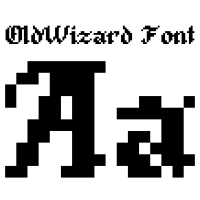

# Font OldWizard for Minetest Font API mod

This mod adds OldWizard font to Font API mod (from [display_modpack](https://github.com/pyrollo/display_modpack)).

For more information, see the [forum topic](https://forum.minetest.net/viewtopic.php?t=13563) at the Minetest forums.

**Dependancies**: font_api

**License**: code under LGPL v2.1, font in Public Domain

## Original Font

**Original font**: OldWizard by Angel

**License**: Public Domain

[Original font site](http://www.pentacom.jp/pentacom/bitfontmaker2/gallery/?id=168)
